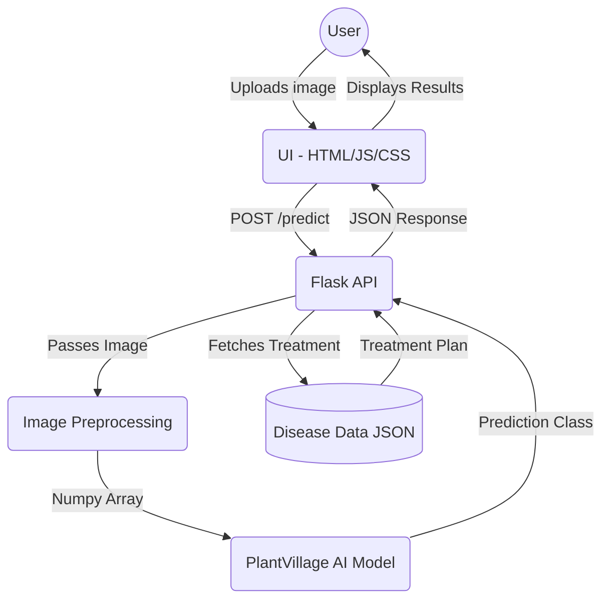

# 🌱 AI Crop Doctor

> **An AI-powered diagnostic tool for farmers to detect plant diseases instantly and get actionable treatment plans.**

---

## 🎯 Architecture Diagram

This is our planned modular architecture for the AI Crop Doctor pipeline:



---

## 📂 Project Structure

```
ai-crop-doctor
├── app
│   ├── model
│   │   └── plant_model.py       # AI model inference mock
│   ├── routes
│   │   └── predict_route.py     # Backend API route
│   └── utils
│       └── preprocess.py        # Image transformations
├── static
│   ├── disease_data.json        # Treatment database
│   ├── script.js                # Frontend logic
│   └── style.css                # Custom UI styling
├── templates
│   └── index.html               # Main Web Interface
├── app.py                       # Flask entry point
├── requirements.txt             # Dependencies
└── README.md                    # Project Documentation
```

---

## 🚀 Checkpoint-02 (Prototype Status)

**Current Progress:**
- ✅ **Architecture:** Defined clear modular separation (Frontend UI, API layer, ML inference pipeline).
- ✅ **Frontend Prototype:** Designed responsive UI allowing drag-and-drop image uploads, integrated with the backend API.
- ✅ **Backend API:** Built basic `/predict` endpoint simulating processing.
- ✅ **AI Pipeline Integration:** Structured functions for `preprocess_image` scaling to (224,224) RGB numpy array to feed the upcoming PyTorch/Keras models.

### 🏃 Running Locally

1. Create a virtual environment and install dependencies:
   ```bash
   pip install -r requirements.txt
   ```
2. Start the application:
   ```bash
   python app.py
   ```
3. Open `http://localhost:5000` in your browser.

---

## 🔮 Roadmap (Next Steps) 

**Version 1 (Upcoming)**
- Integrate the real trained PlantVillage ML model.
- Dynamic health scores.

**Version 2 (Future Scope)**
- Weather prediction integration.
- Analytics dashboard & SMS alerts.
